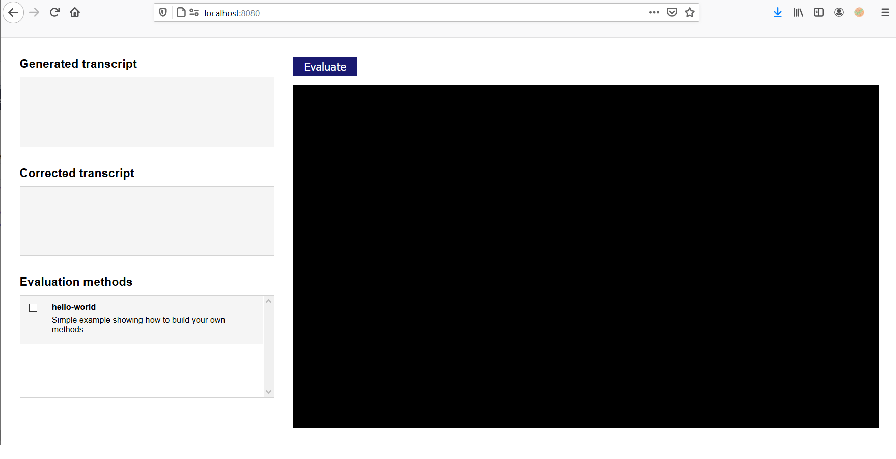
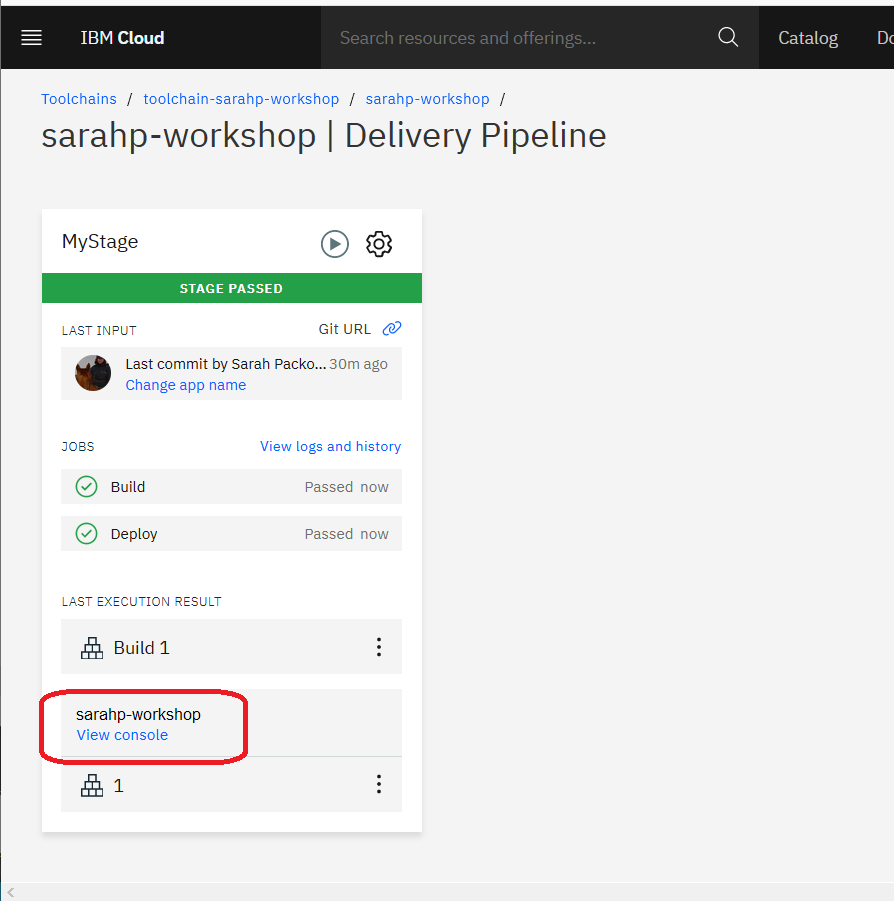
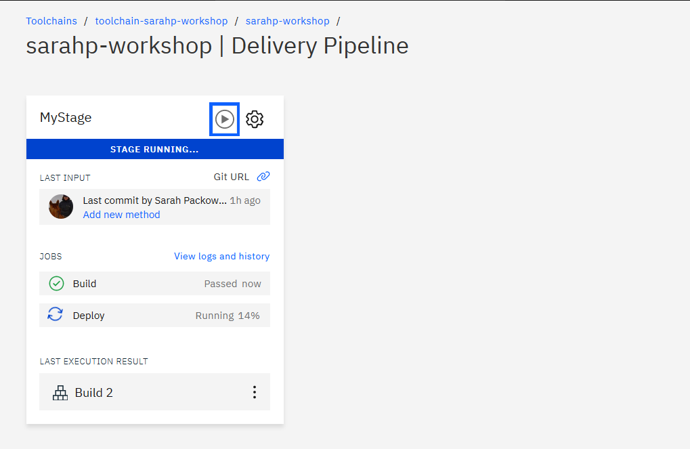

# CASCON 2020 Workshop: Model evaluation framework

&nbsp;

## Background information
To evaluate AI model performance, our team developed a simple framework that applies multiple model evaluation methods simultaneously:

The framework was deployed to IBM Cloud using a GitHub-integrated continuous delivery pipeline.

This workshop walks you through deploying a simple version of our framework as a Python Flask app to IBM Cloud, using a continuous delivery pipeline with GitHub.

See: [Long abstract](long-abstract_Collaborative-Framework-Workshop_CASCON-2020.pdf)

&nbsp;

## Setup before the workshop

Perform these steps before starting the hands-on workshop:
1. [Register for an IBM Cloud account](https://cloud.ibm.com/registration)
2. [Create an account on public GitHub](https://github.com/join)
3. [Install Git CLI on your local computer](https://git-scm.com/downloads)
4. [Install Python on your local computer](https://www.python.org/downloads)

&nbsp;

# Workshop instructions
- [Section A: Run the sample app on your local computer](#section-a-run-the-sample-app-on-your-local-computer)
- [Section B: Create a repository in GitHub](#section-b-create-a-repository-in-github)
- [Section C: Deploy app to IBM Cloud using a continuous delivery pipeline](#section-c-deploy-app-to-ibm-cloud-using-a-continuous-delivery-pipeline)
- [Section D: Deliver an update to the app](#section-d-deliver-an-update-to-the-app)

&nbsp;

## Section A: Run the sample app on your local computer
See: [Section A Demo video](./videos/section-A.mp4)

### A.1 Download sample code
<ol>
<li>

Create a local working directory

</li>
<li>

In your browser, navigate to the <a href="https://github.com/spackows/CASCON-2020-Workshop_Model-evaluation-framework">sample GitHub repo</a>

</li>
<li>

Click the button labeled <code>Code</code> and then select "Download ZIP" to download the sample code

</li>
<li>

Uncompress the sample code into your working directory

</li>
</ol>

### A.2 Set up local environment
<ol>
<li>
On a command line, in the working directory, create a new local, virtual Python environment: <code>python -m venv &lt;virtual-environment-name></code> 

</li>
<li>

Use the virtual environment: Windows <code>&lt;virtual-environment-name>\Scripts\activate.bat</code> UNIX or MacOS <code>source &lt;virtual-environment-name>/bin/activate</code>

</li>
<li>

In the <code>src</code> subdirectory of the sample code, install Python libraries required for the sample app: <code>pip install -r requirements.txt</code>

</li>
</ol>

### A.3 Run the app locally
<ol>
<li>

Run the app: <code>python server.py</code>

</li>
<li>

Test the <code>listmethods</code> endpoint of the sample app by opening a new browser tab with this address: <a href="http://localhost:8080/listmethods">http://localhost:8080/listmethods</a>

</li>
<li>

Test the sample web app by opening a new browser tab with this address: <a href="http://localhost:8080">http://localhost:8080</a>

</li>
</ol>

&nbsp;

## Section B: Create a repository in GitHub
See: [Section B Demo video](./videos/section-A.mp4)

### B.1 Create a new repo
<ol>
<li>

Log in to GitHub: <a href="https://github.com">https://github.com</a>

</li>
<li>

Click the button for creating a new repository (repo)

</li>
<li>

Give your new repo a unique name, accept the default options, and then click <code>Create repository</code>

</li>
</ol>

### B.2 Clone your repo to your local computer
<ol>
<li>

Copy the URL of your new GitHub repo
</li>
<li>

On your local computer, from your working directory, use the <code>git clone</code> command, specifying the URL of your repo: <code>git clone &lt;your-url></code>
</li>
</ol>

### B.3 Copy sample code to your local repo directory
<ol>
<li>

Copy the sample app files from the <code>src</code> sub-directory to the directory of your new repo on your local computer

</li>
<li>

The app name forms part of the app URL, so your app needs a unique name.  On your local computer, change the app name in two files:
<ul>
<li><code>manifest.yml</code></li>
<li><code>setup.py</code></li>
</ul>

<b>Example</b> For the workshop, you could use your initials or part of your name to make a unique app name: 

</li>
</ol>

### B.4 Push sample app code to your repo
Use git commands to add the files to your repo:
<pre>git add -A
git commit -m "&lt;comment>"
git push origin main</pre>

&nbsp;

## Section C: Deploy app to IBM Cloud using a continuous delivery pipeline
See: [Section C Demo video](./videos/section-C.mp4)

### C.1 Create a new Continuous Delivery service instance
Log in to [IBM Cloud](https://cloud.ibm.com) and then provision an instance of the [Continuous delivery service](https://cloud.ibm.com/catalog/services/continuous-delivery)

When you provision the instance, take note of the region the instance is created in:

### C.2 Create a toolchain
<ol>
<li>

From the <b>Getting Started</b> page of your Continuous Delivery service instance, click <code>create a toolchain</code>

</li>
<li>

From the list of options, choose <b>Build your own toolchain</b>: 

</li>
<li>

When creating your toolchain, select the same <b>Region</b> as the Continuous Delivery service was created in: 

</li>
</ol>

### C.3 Add a GitHub integration to your toolchain
<ol>
<li>

From the <b>Overview</b> page of your toolchain, click <code>Add tool</code>

</li>
<li>

Choose <b>GitHub</b>: 

</li>
<li>

Configure the GitHub integration for your new GitHub repo, and then click <code>Create Integration</code> <b>Note: uncheck "Enable GitHub issues"</b> 

</li>
</ol>

### C.4 Add a delivery pipeline to your toolchain
<ol>
<li>

From the <b>Overview</b> page of your toolchain, click <code>Add tool</code>

</li>
<li>

Choose <b>Delivery Pipeline</b>: 

</li>
<li>

Give your pipeline the same name as your app, and then click <code>Create Integration</code>

</li>
</ol>

### C.5 Add a stage to your delivery pipeline
<ol>
<li>

From the <b>Overview</b> page of your toolchain, click on the delivery pipeline to configure it

</li>
<li>
Click <code>Add Stage</code>
</li>
</li>
<li>

On the <b>Input</b> tab, confirm the information has been filled in by default from the GitHub integration

</li>
<li>

On the <b>Jobs</b> tab, add a Build job:
<ol>
<li>Click <code>ADD JOB</code></li>
<li>Select "Build"</li>
<li>Accept the defaults</li>
</ol>

</li>
<li>

On the <b>Jobs</b> tab, add a Deploy job:
  <ol>
  <li>Click <code>ADD JOB</code></li>
  <li>Select "Deploy"</li>
  <li>Add an API key:
    <ol>
    <li>Click in the <b>API key</b> text box</li>
    <li>Click <code>New</code></li>
    <li>Give your API key a name</li>
    <li>Click <code>OK</code></li>
    <li>Click <code>Authenticate</code></li>
    </ol></li>
  </ol>

</li>
<li>

Scroll to the bottom of the page, and then click <code>Save</code>

</li>
</ol>

### C.6 Run the pipeline and test the deployed app
<ol>
<li>

Click the <i>play</i> button to run the pipeline: 

</li>
<li>

After the stage completes, right-click on <code>View console</code> and open the add details page in a new browser tab: 

</li>
<li>

On the app details page, you can review run-time logs and you can click <code>Visit App URL</code> to test the web app running on IBM Cloud: 

</li>
</ol>

&nbsp;

## Section D: Deliver an update to the app
See: [Section D Demo video](./videos/section-D.mp4)

### D.1 Add a new evaluation method to the framework locally
<ol>
<li>

In the <code>eval_methods</code> subdirectory, make a copy of the "eval_hello-world.py" example file

</li>
<li>

Make a minor change to your second evaluation method file

</li>
</ol>

### D.2 Test the change locally
<ol>
<li>

Run the updated app locally with the <code>python server.py</code> command 

</li>
<li>

Open <a href="http://localhost:8080">http://localhost:8080</a> in your browser, and look for the new evaluation method: 

</li>
</ol>

### D.3 Push the change to your GitHub repo
Use the same git commands as before to push the change to your repo:

<pre>git add -A
git commit -m "&lt;comment>"
git push origin main</pre>

### D.4 Monitor the automated app redeployment
On the pipeline delivery page in IBM Cloud, monitor the progress of the build and deploy stages:

### D.5 Confirm the change has been redeployed to IBM Cloud
View your app on IBM Cloud to confirm the change has been redeployed.

&nbsp;

